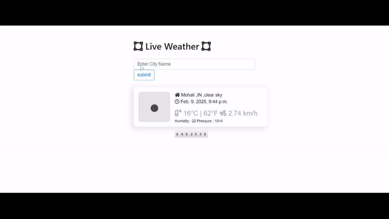

# Weather App

This repository contains a simple weather application built with Django. The app allows users to search for weather information by city name. It uses the OpenWeatherMap API to fetch current weather data and displays the information on the home page.

## Features

- Search for weather information by city name
- Display current weather conditions
- Show temperature in both Kelvin and Celsius
- Display weather description and icons
- Show additional weather details such as pressure, humidity, and wind speed
- Prevent form resubmission issues using the Post/Redirect/Get pattern

## Installation
Follow these steps to set up and run the project:

1. Create a Virtual Environment
```
python -m venv .venv
```
2. Activate the Virtual Environment
```
.venv\Scripts\activate
```
3. Install the Required Packages
```
pip install -r requirements.txt
```
4. Apply Database Migrations
```
python manage.py migrate
```
5. Run the Development Server
```
python manage.py runserver
```


## Usage
- Home Page: Displays a form to search for weather information by city name.

- Weather Data: Shows current weather conditions including temperature, description, country, pressure, humidity, and wind speed.

## Example
After submitting the city name, the app fetches weather data from the OpenWeatherMap API and displays it on the home page. For example, searching for "mohali" displays the current weather in Mohali.

## Implementation Details
- home View: Handles the form submission and fetches weather data from the OpenWeatherMap API. Implements the Post/Redirect/Get (PRG) pattern to prevent form resubmission issues.

- Template Rendering: Renders the home page with weather data.

